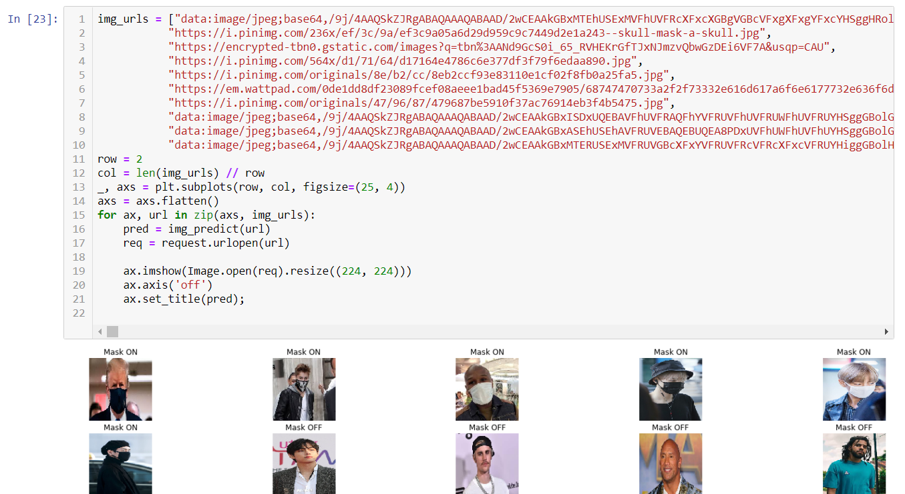

# Real-Time-Face-Mask-Detector
detecting people that are wearing face mask or not, with pytorch.  
using the webcam to see wiether the face mask is on or off. 
### Dataset Link:
 https://www.kaggle.com/ashishjangra27/face-mask-12k-images-dataset
 
 ### Example:
 
